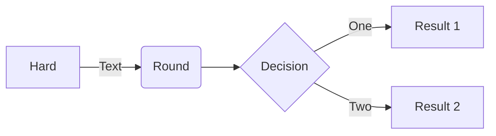

# Computer Science Degree In Python

## What Is This Repo?

This repository is an effort to capture (as much as possible) the work a student in a Computer Science Degree program would produce. In essence, I'm re-doing almost all of my Computer Science assignments in Python (except where that's not possible, or I just don't know how to do so yet).

## Why Re-do Everything In Python?

There are a few reasons I'm doing this. 
1. I like Python. Most of my degree required using Java, C, or R and I'd like to transfer all of that code into Python code. 
2. I had a few times where I really flubbed an assignment and this an opportunity for me to go back and fix issues. 
3. I need more practice with GitHub and this project will have me in GitHub more than all of the rest of the time I've worked in here combined. 
4. I'm used to producing documentation in FrameMaker and I get to play with Markdown. 

## Who Is This For?

Honestly, I'm not sure who can benefit from this repo. Anyone who's been developing for a few years in Python should zip right through the assignments. Developers in any language might be able to use this repo for the assignments as a way to work through Python's features in a systematic way. This repo will not include full enough information to guide an absolute beginner through. Still, comments, edits, and suggestions are all welcome!

## Links To Sections

Year One

#### [Year One](Year_One/Year_One.md)
*   [Introduction to Programming](Year_One/1.IntroductionToProgramming/IntroToProgramming.md)
*   [Programming Principles I](Year_One/2.ProgrammingPrinciplesI/ProgrammingPrinciplesI.md)
*   [Programming Principles II](Year_One/3.ProgrammingPrinciplesII/ProgrammingPrinciplesII.md)
*   [Object Oriented Programming](Year_One/4.ObjectOrientedProgramming/OOP.md)
*   [Algebra and Pre-Calculus](Year_One/5.AlgebraAndPre-Calc/Algebra.md)

Year Two

#### [Year Two](Year_Two/Year_Two.md)

*   [Data Structures](Year_Two/1.DataStructures/DataStructures.md)
*   [Algorithms](Year_Two/2.Algorithms/Algorithms.md)
*   [Relational Database Systems](Year_Two/3.RDBS/RDBS.md)
*   [Web Development](Year_Two/4.WebDev/WebDev.md)
*   [Web Scraping](Year_Two/5.WebScraping/WebScraping.md)

Year Three

#### [Year Three](Year_Three/Year_Three.md)

*   [Data Mining](Year_Three/1.DataMining/DataMining.md)
*   [Big Data Analytics](Year_Three/2.BigData/BigData.md)
*   [Natural Language Processing](Year_Three/3.NLP/NLP.md)
*   [Parallel & Cloud Computing](Year_Three/4.Parallel/Parallel.md)

