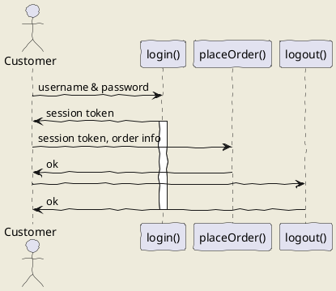
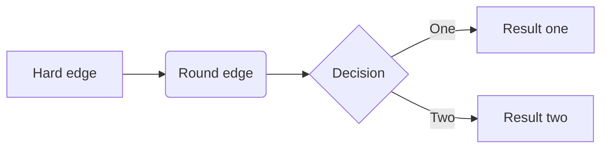
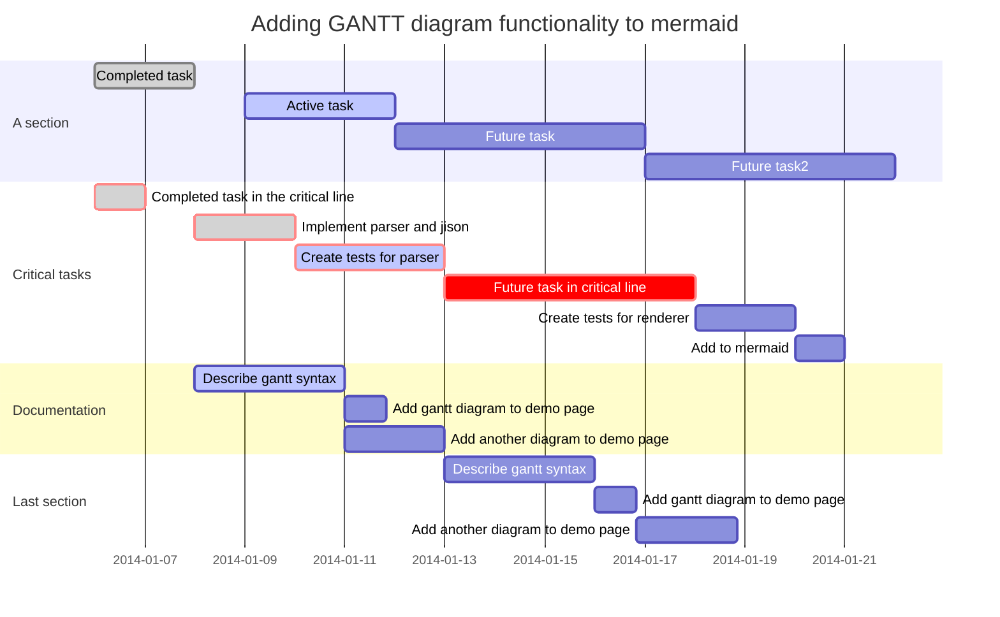
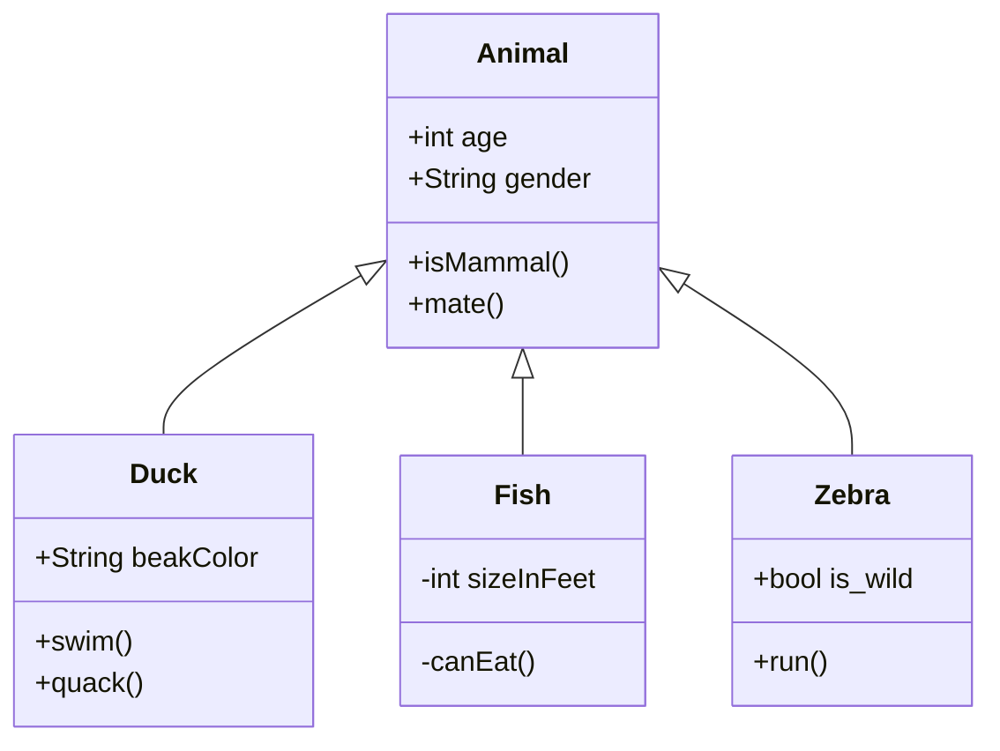
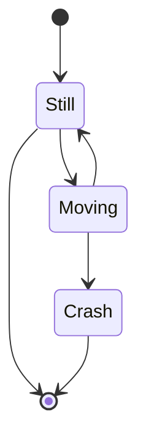
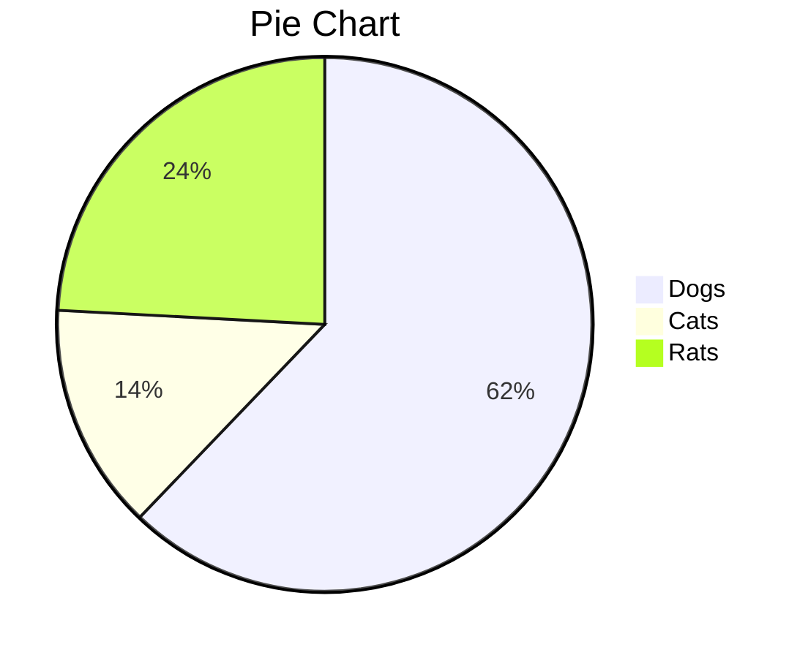

# Style Guide

## Text
### Heading Levels
    # Heading 1
    ## Heading 2
    ### Heading 3
    ### Heading 4

plain text

    plain text

*italic text*

    *italic text*

**bold text**

    **bold text**

***bold italic text***

    ***bold italic text***

### Code
```python
s = "Python code block"
print(s)
```

    ```python
    s = "Python code block"
    print(s)
    ```

```javascript
var s = "JavaScript code block";
alert(s);
```

    ```javascript
    var s = "JavaScript code block";
    alert(s);
    ```

```html
HTML syntax highlighting. 
But let's throw in another <b>tag</b>.
```

    ```html
    HTML syntax highlighting. 
    But let's throw in another <b>tag</b>.
    ```

```
No language indicated, so no syntax highlighting. 
But let's throw in a <b>tag</b>.
```

    ```
    No language indicated, so no syntax highlighting. 
    But let's throw in a <b>tag</b>.
    ```

## Information Display

### Lists
**Unordered List**
*   item
*   item
    *   sub-item
*   item

**Ordered List**
1.   item
2.   item
3.   item


### Tables

| Tables        | Are           | Cool  |
| ------------- |:-------------:| -----:|
| col 3 is      | right-aligned | $1600 |
| col 2 is      | centered      |   $12 |
| zebra stripes | are neat      |    $1 |

| One    | Two | Three | Four    | Five  | Six
|-|-|-|-|-|-
| Span <td colspan=3>triple  <td colspan=2>double

## Images

### Linked Videos

**Traditional HTML**

<a href="http://www.youtube.com/watch?feature=player_embedded&v=eJojC3lSkwg" target="_blank"></a>

    <a href="http://www.youtube.com/watch?feature=player_embedded&v=YOUTUBE_VID_ID_HERE" target="_blank"></a>

**Pure Markdown**

[](http://www.youtube.com/watch?v=eJojC3lSkwg)

    [](http://www.youtube.com/watch?v=YOUTUBE_VID_ID_HERE)




### Flowchart



```flow
st=>start: Start
op=>operation: Your Operation
cond=>condition: Yes or No?
e=>end

st->op->cond
cond(yes)->e
cond(no)->op
```


### Gantt Chart




### Class Diagram



### State Diagram



### Pie Chart




Resources:
https://support.typora.io/Draw-Diagrams-With-Markdown/
https://github.com/adam-p/markdown-here/wiki/Markdown-Cheatsheet