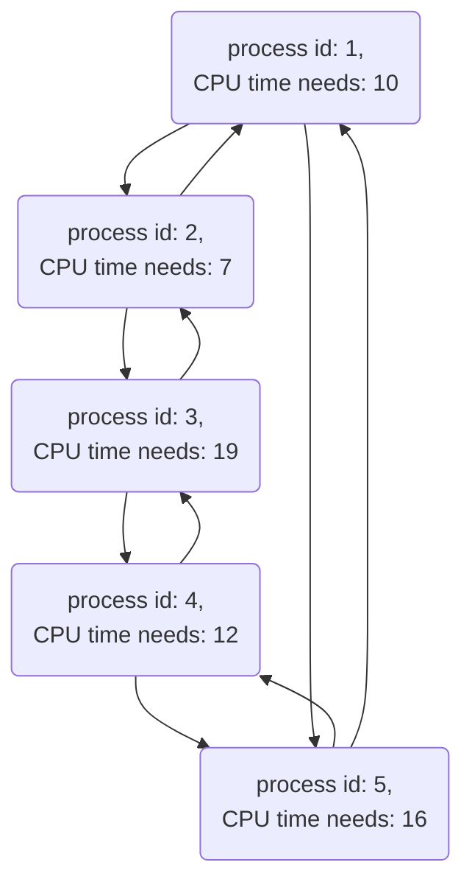

# Assignment Three  

[<< Go back up a level](DataStructures.md)

## Assignment Overview
Implement a simple version of a Round-Robin scheduler by using a circular doubly linked list data structure.

Round-robin scheduling: In the round-robin scheduler, all processes are organized in a circle. The CPU serves the processes one by one by going around the circle. Every time a process is served, it will be served for a pre-determined fixed amount of time unless the process terminates earlier. For example, if the following are the processes currently running in a system, where each process is represented by a [process id, process’s CPU time needs] tuple:

[1, 10], [2, 7], [3, 19], [4, 12], [5, 16]

Suppose the length of each CPU service time is 5 and all the processes are served in the order as they
are shown above. Then we will have the following processes along with their CPU time needs after each
round of CPU service:
*  After the first round of service: [1, 5], [2, 2], [3, 14], [4, 7], [5, 11]
*  After the second round of service: [3, 9], [4, 2], [5, 6]
*  After the third round of service: [3, 4], [5, 1]
*  After the fourth round of service, all processes terminate.

#### Review Singly Linked List

[Singly Linked List (code)](SinglyLinkedList.py)

[Singly Linked List Tester (code)](test_SinglyLinkedList.py)

#### Review Doubly Linked List

[Doubly Linked List (code)](DoublyLinkedList.py)

[Doubly Linked List Tester (code)](test_DoublyLinkedList.py)

### Circular Doubly Linked List

### Background

Roughly speaking from the operating system’s point of view, a process is a running program. Modern computer operating systems, such as Microsoft Windows, various Linux deliveries, and MacOS, support multiprocess (or also called multi-task or multi-job) computing, meaning the user can run multiple programs simultaneously on one machine. However, any single computer processing unit (such as a core within a multi-core CPU or a single-core CPU) can do the computation for only one process at any moment. So, how to run the multiple processes “simultaneously” on one machine ? The way that the operating system does is to let the CPU serve one process for a very short period of time and then switch the CPU to serve another process and so on. By doing so, the user feels that all the processes are running in parallel. This raises the following important and challenging question: how to schedule/queue the processes so that they can be served “fairly” and the overall multi-process system looks working quite smoothly ? This question is about process scheduling and there are many different scheduling policies/strategies/algorithms dealing with this issue by considering different needs and targeting different goals. In this programming assignment, we want to implement a very basic and simple version of the <a href="https://en.wikipedia.org/wiki/Round-robin_scheduling" target="_blank">Round-Robin</a> scheduling by using a circular doubly linked list data structure.

### Program Specifications
1.  Your program should be named: RoundRobin.py
2.  The input and output of your program.

There are two inputs to your program. One is a text file, that contains a list of [process id, process’s CPU time needs] tuples. Each line of the text file is one tuple. The two fields of each tuple are separated by the comma symbol. You can assume all process ids are distinct. The file name should be supplied to your program as a command line parameter. The other input, which is also supplied as a parameter to your program, is a positive integer number representing the length of each CPU service.

The output should be a sequence of process ids that are in the ascending order of their termination time, separated by the comma symbol. We require all processes be served at the order of their ids in each round.

## Assignment Notes:

You need to construct a circular doubly linked list to organize all the processes from the input file, where each node represents a process. The nodes in the circular doubly linked list are sorted on their process ids, so that in each round of service, the processes will be served at the ascending order of their ids. Note that it is NOT allowed that you first store and sort the processes in a temporary array and then load them into the circular doubly linked list. You must insert the given processes into the correct positions in the circular doubly linked list when they are read from the input file. Your program will then scan the circular linked list round by round starting from the process with the smallest id. Every time after a process is served for the specified amount of time, if the process has no more CPU time needs meaning the process has terminated, then the linked list node representing that process must be deleted from the linked list and the corresponding process id should be printed on the screen. The deletion of any terminated process must be an O(1)-time operation.

#### Getting Started

[data file](ass3_data.txt)

[bigger data file (extra credit)](ass3_big_data.txt)

#### Questions for you to consider

### Sample Interactions:

Suppose we supply to your program with the file named ass3.txt that has the following content, along
with each CPU service time length being 5:

    1,10
    5,16
    2,7
    4,12
    3,19

Then, the command line you should type would be:

    $python RoundRobin.py ass3_data.txt 5

Then your program will construct the following circular doubly linked list to start with:

and the output should be:

    $1,2,4,3,5

### Solution
